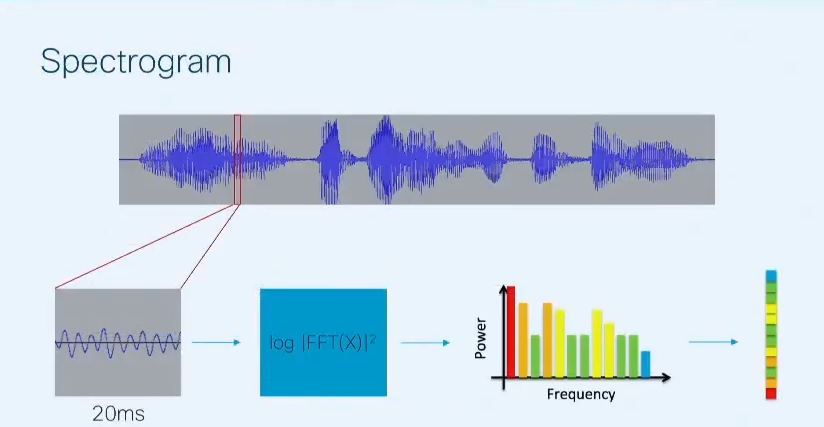

# Speach-Recognition

This is a simple speach Recognition algorithum. This was a Learning Project, in which I learnt how to apply machine learning on sounds,using a concepts like Mfcc and role of fourier transform.
 
 

## Processing Flow
---

